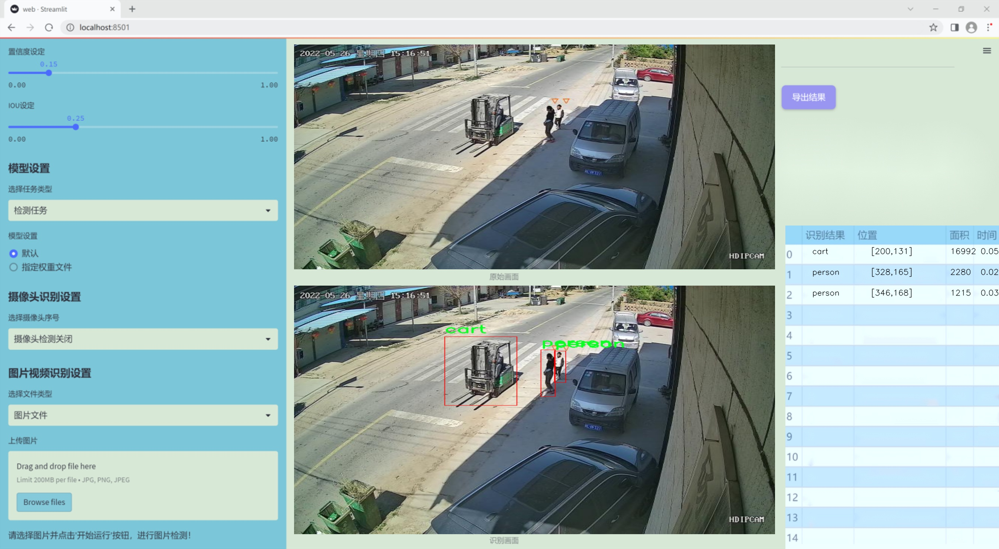
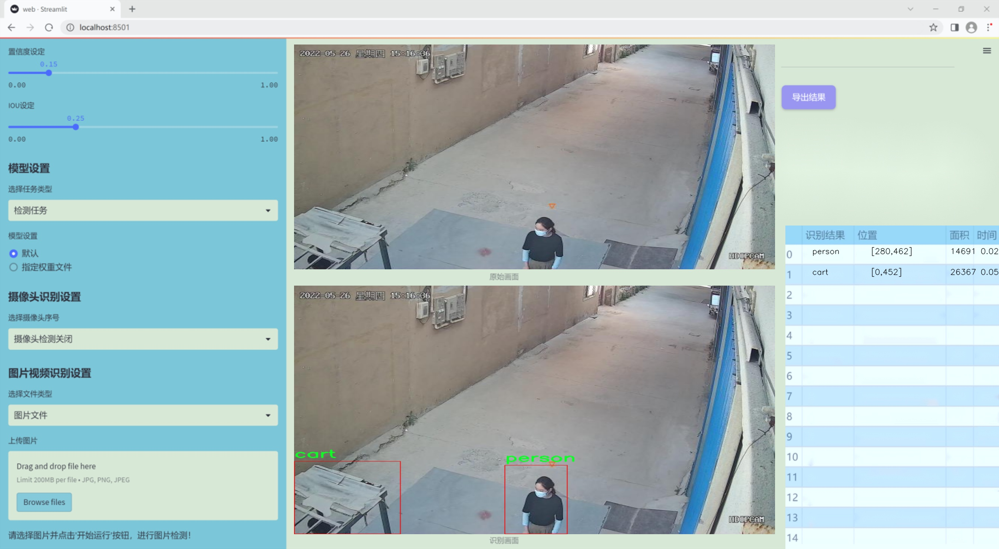
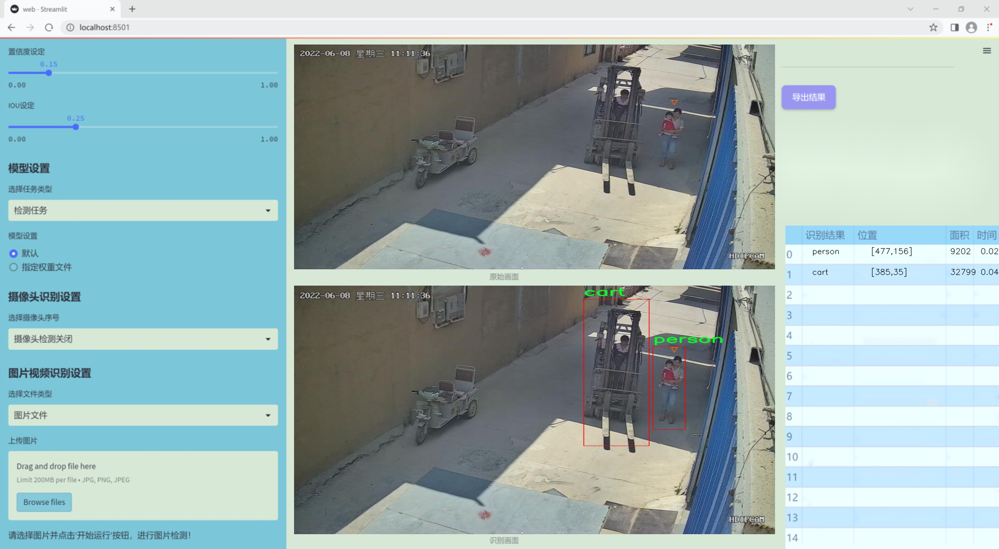
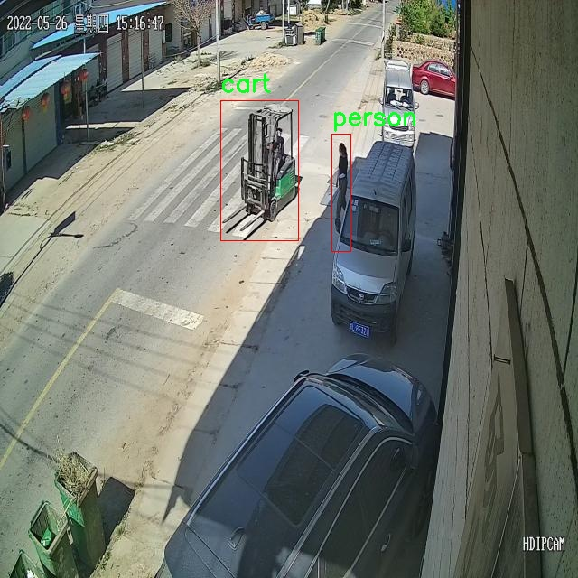
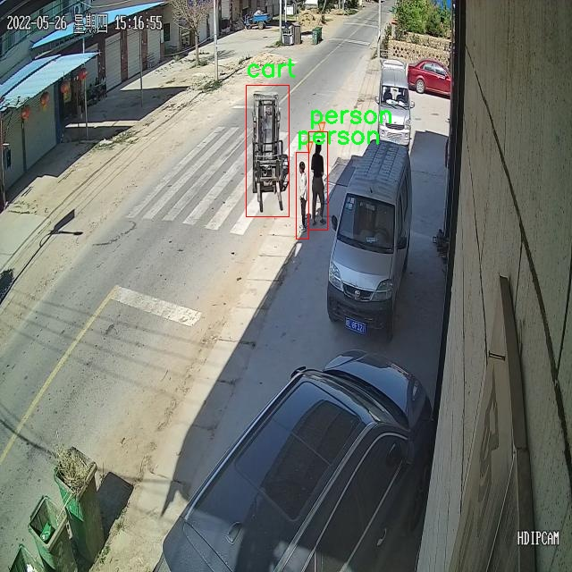
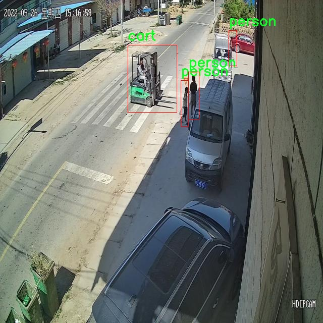
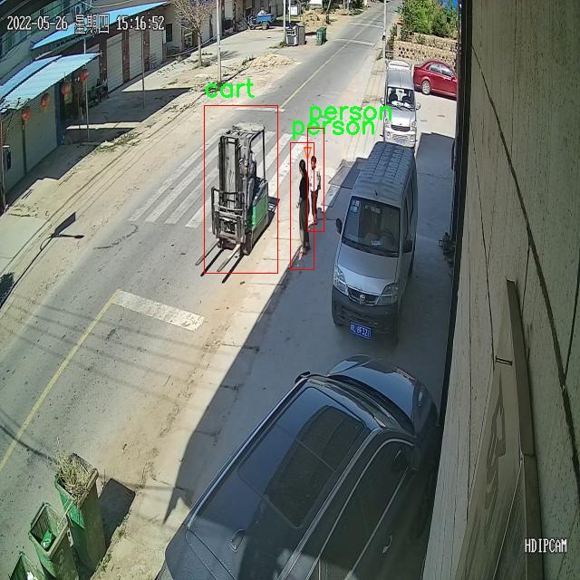
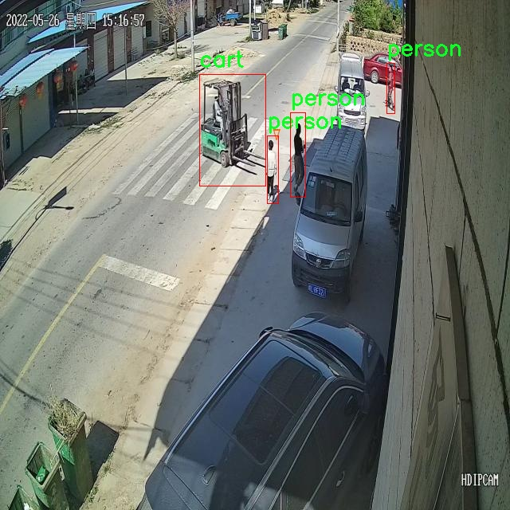

# 改进yolo11-CA-HSFPN等200+全套创新点大全：叉车与人类交互检测系统源码＆数据集全套

### 1.图片效果展示







##### 项目来源 **[人工智能促进会 2024.10.30](https://kdocs.cn/l/cszuIiCKVNis)**

注意：由于项目一直在更新迭代，上面“1.图片效果展示”和“2.视频效果展示”展示的系统图片或者视频可能为老版本，新版本在老版本的基础上升级如下：（实际效果以升级的新版本为准）

  （1）适配了YOLOV11的“目标检测”模型和“实例分割”模型，通过加载相应的权重（.pt）文件即可自适应加载模型。

  （2）支持“图片识别”、“视频识别”、“摄像头实时识别”三种识别模式。

  （3）支持“图片识别”、“视频识别”、“摄像头实时识别”三种识别结果保存导出，解决手动导出（容易卡顿出现爆内存）存在的问题，识别完自动保存结果并导出到tempDir中。

  （4）支持Web前端系统中的标题、背景图等自定义修改。

  另外本项目提供训练的数据集和训练教程,暂不提供权重文件（best.pt）,需要您按照教程进行训练后实现图片演示和Web前端界面演示的效果。

### 2.视频效果展示

[2.1 视频效果展示](https://www.bilibili.com/video/BV18CSeYLEi1/)

### 3.背景

研究背景与意义

随着工业自动化的不断发展，叉车作为重要的物料搬运设备，广泛应用于仓储、物流等领域。然而，叉车在高强度的工作环境中，往往与人类工人近距离接触，这使得叉车与人类之间的安全交互问题愈发突出。根据相关统计数据，叉车与人类之间的碰撞事故频发，给工人生命安全和企业运营带来了严重威胁。因此，构建一个高效的叉车与人类交互检测系统，能够实时监测叉车周围的人类活动，确保安全作业，具有重要的现实意义。

本研究基于改进的YOLOv11（You Only Look Once Version 11）模型，旨在提升叉车与人类交互检测的准确性和实时性。YOLO系列模型以其快速的检测速度和较高的准确率在目标检测领域取得了显著的成就。通过对YOLOv11进行改进，结合特定的叉车与人类交互场景，我们能够更好地适应复杂的工作环境，提高对叉车与人类的识别能力。

本项目使用的数据集包含1900张图像，涵盖了叉车和人类的交互场景，具体分类包括“叉车”和“人”。这些数据的多样性和丰富性为模型的训练提供了坚实的基础。通过对数据集的深入分析和处理，我们将能够有效提升模型的泛化能力，确保其在实际应用中的可靠性。

综上所述，基于改进YOLOv11的叉车与人类交互检测系统的研究，不仅有助于提升工业环境中的安全性，还为智能制造和自动化物流的发展提供了技术支持，具有广泛的应用前景和深远的社会意义。

### 4.数据集信息展示

##### 4.1 本项目数据集详细数据（类别数＆类别名）

nc: 2
names: ['cart', 'person']


该项目为【目标检测】数据集，请在【训练教程和Web端加载模型教程（第三步）】这一步的时候按照【目标检测】部分的教程来训练

##### 4.2 本项目数据集信息介绍

本项目数据集信息介绍

本项目所使用的数据集名为“Forklift and Human”，旨在为改进YOLOv11的叉车与人类交互检测系统提供高质量的训练数据。该数据集专注于叉车与人类之间的互动场景，特别是在工业和仓储环境中，叉车的安全操作与人类的安全行为密切相关。数据集中包含两类主要对象，分别为“cart”（叉车）和“person”（人类），共计两个类别。这一设计使得模型能够在复杂的工作环境中有效识别叉车与人类的相对位置和动态交互，从而提高安全性和工作效率。

“Forklift and Human”数据集经过精心标注，涵盖了多种场景和不同的光照条件，以确保模型在实际应用中的鲁棒性。数据集中的图像来源于多个真实的工作环境，展示了叉车在执行任务时与周围人类的互动情况。这种多样性不仅有助于提升模型的泛化能力，还能增强其在各种情况下的识别准确性。

此外，数据集的构建考虑到了不同角度和距离下的视觉信息，确保模型能够在不同的视野下进行有效检测。通过对“cart”和“person”这两类对象的精确标注，数据集为YOLOv11的训练提供了坚实的基础，使其能够更好地理解和预测叉车与人类之间的交互行为。最终目标是实现一个智能化的检测系统，能够实时监测叉车与人类的动态关系，降低事故发生的风险，提升工作场所的安全性。











### 5.全套项目环境部署视频教程（零基础手把手教学）

[5.1 所需软件PyCharm和Anaconda安装教程（第一步）](https://www.bilibili.com/video/BV1BoC1YCEKi/?spm_id_from=333.999.0.0&vd_source=bc9aec86d164b67a7004b996143742dc)


[5.2 安装Python虚拟环境创建和依赖库安装视频教程（第二步）](https://www.bilibili.com/video/BV1ZoC1YCEBw?spm_id_from=333.788.videopod.sections&vd_source=bc9aec86d164b67a7004b996143742dc)

### 6.改进YOLOv11训练教程和Web_UI前端加载模型教程（零基础手把手教学）

[6.1 改进YOLOv11训练教程和Web_UI前端加载模型教程（第三步）](https://www.bilibili.com/video/BV1BoC1YCEhR?spm_id_from=333.788.videopod.sections&vd_source=bc9aec86d164b67a7004b996143742dc)


按照上面的训练视频教程链接加载项目提供的数据集，运行train.py即可开始训练



     Epoch   gpu_mem       box       obj       cls    labels  img_size
     1/200     20.8G   0.01576   0.01955  0.007536        22      1280: 100%|██████████| 849/849 [14:42<00:00,  1.04s/it]
               Class     Images     Labels          P          R     mAP@.5 mAP@.5:.95: 100%|██████████| 213/213 [01:14<00:00,  2.87it/s]
                 all       3395      17314      0.994      0.957      0.0957      0.0843

     Epoch   gpu_mem       box       obj       cls    labels  img_size
     2/200     20.8G   0.01578   0.01923  0.007006        22      1280: 100%|██████████| 849/849 [14:44<00:00,  1.04s/it]
               Class     Images     Labels          P          R     mAP@.5 mAP@.5:.95: 100%|██████████| 213/213 [01:12<00:00,  2.95it/s]
                 all       3395      17314      0.996      0.956      0.0957      0.0845

     Epoch   gpu_mem       box       obj       cls    labels  img_size
     3/200     20.8G   0.01561    0.0191  0.006895        27      1280: 100%|██████████| 849/849 [10:56<00:00,  1.29it/s]
               Class     Images     Labels          P          R     mAP@.5 mAP@.5:.95: 100%|███████   | 187/213 [00:52<00:00,  4.04it/s]
                 all       3395      17314      0.996      0.957      0.0957      0.0845


###### [项目数据集下载链接](https://kdocs.cn/l/cszuIiCKVNis)

### 7.原始YOLOv11算法讲解


###### YOLOv11改进方向

与YOLOv 10相比，YOLOv 11有了巨大的改进，包括但不限于：

  * 增强的模型结构：模型具有改进的模型结构，以获取图像处理并形成预测
  * GPU优化：这是现代ML模型的反映，GPU训练ML模型在速度和准确性上都更好。
  * 速度：YOLOv 11模型现在经过增强和GPU优化以用于训练。通过优化，这些模型比它们的前版本快得多。在速度上达到了25%的延迟减少！
  * 更少的参数：更少的参数允许更快的模型，但v11的准确性不受影响
  * 更具适应性：更多支持的任务YOLOv 11支持多种类型的任务、多种类型的对象和多种类型的图像。

###### YOLOv11功能介绍

Glenn Jocher和他的团队制作了一个令人敬畏的YOLOv 11迭代，并且在图像人工智能的各个方面都提供了YOLO。YOLOv 11有多种型号，包括：

  * 对象检测-在训练时检测图像中的对象
  * 图像分割-超越对象检测，分割出图像中的对象
  * 姿态检测-当用点和线训练时绘制一个人的姿势
  * 定向检测（OBB）：类似于对象检测，但包围盒可以旋转
  * 图像分类-在训练时对图像进行分类

使用Ultralytics Library，这些模型还可以进行优化，以：

  * 跟踪-可以跟踪对象的路径
  * 易于导出-库可以以不同的格式和目的导出
  * 多场景-您可以针对不同的对象和图像训练模型

此外，Ultralytics还推出了YOLOv 11的企业模型，该模型将于10月31日发布。这将与开源的YOLOv
11模型并行，但将拥有更大的专有Ultralytics数据集。YOLOv 11是“建立在过去的成功”的其他版本的之上。

###### YOLOv11模型介绍

YOLOv 11附带了边界框模型（无后缀），实例分割（-seg），姿态估计（-pose），定向边界框（-obb）和分类（-cls）。

这些也有不同的尺寸：纳米（n），小（s），中（m），大（l），超大（x）。


YOLOv11模型

###### YOLOv11与前版本对比

与YOLOv10和YOLOv8相比，YOLOv11在Ultralytics的任何帖子中都没有直接提到。所以我会收集所有的数据来比较它们。感谢Ultralytics：

**检测：**


YOLOv11检测统计


YOLOv10检测统计

其中，Nano的mAPval在v11上为39.5，v10上为38.5；Small为47.0 vs 46.3，Medium为51.5 vs
51.1，Large为53.4 vs 53.2，Extra Large为54.7vs
54.4。现在，这可能看起来像是一种增量增加，但小小数的增加可能会对ML模型产生很大影响。总体而言，YOLOv11以0.3
mAPval的优势追平或击败YOLOv10。

现在，我们必须看看速度。在延迟方面，Nano在v11上为1.55 , v10上为1.84，Small为2.46 v2.49，Medium为4.70
v4.74，Large为6.16 v7.28，Extra Large为11.31
v10.70。延迟越低越好。YOLOv11提供了一个非常低的延迟相比，除了特大做得相当差的前身。

总的来说，Nano模型是令人振奋的，速度更快，性能相当。Extra Large在性能上有很好的提升，但它的延迟非常糟糕。

**分割：**


YOLOV11 分割统计


YOLOV9 分割统计


YOLOV8 分割数据

总体而言，YOLOv 11上的分割模型在大型和超大型模型方面比上一代YOLOv 8和YOLOv 9做得更好。

YOLOv 9 Segmentation没有提供任何关于延迟的统计数据。比较YOLOv 11延迟和YOLOv 8延迟，发现YOLOv 11比YOLOv
8快得多。YOLOv 11将大量GPU集成到他们的模型中，因此期望他们的模型甚至比CPU测试的基准更快！

姿态估计：


YOLOV11姿态估计统计


YOLOV8姿态估计统计

YOLOv 11的mAP 50 -95统计量也逐渐优于先前的YOLOv 8（除大型外）。然而，在速度方面，YOLOv
11姿势可以最大限度地减少延迟。其中一些延迟指标是版本的1/4！通过对这些模型进行GPU训练优化，我可以看到指标比显示的要好得多。

**定向边界框：**


YOLOv11 OBB统计


YOLOv8 OBB统计

OBB统计数据在mAP
50上并不是很好，只有非常小的改进，在某种程度上小于检测中的微小改进。然而，从v8到v11的速度减半，这表明YOLOv11在速度上做了很多努力。

**最后，分类：**


YOLOv 11 CLS统计


YOLOv8 CLS统计

从v8到v11，准确性也有了微小的提高。然而，速度大幅上升，CPU速度更快的型号。


### 8.200+种全套改进YOLOV11创新点原理讲解

#### 8.1 200+种全套改进YOLOV11创新点原理讲解大全

由于篇幅限制，每个创新点的具体原理讲解就不全部展开，具体见下列网址中的改进模块对应项目的技术原理博客网址【Blog】（创新点均为模块化搭建，原理适配YOLOv5~YOLOv11等各种版本）

[改进模块技术原理博客【Blog】网址链接](https://gitee.com/qunmasj/good)


#### 8.2 精选部分改进YOLOV11创新点原理讲解

###### 这里节选部分改进创新点展开原理讲解(完整的改进原理见上图和[改进模块技术原理博客链接](https://gitee.com/qunmasj/good)【如果此小节的图加载失败可以通过CSDN或者Github搜索该博客的标题访问原始博客，原始博客图片显示正常】


### HRNet V2简介
现在设计高低分辨率融合的思路主要有以下四种：


（a）对称结构。如U-Net、Hourglass等，都是先下采样再上采样，上下采样过程对称。

（b）级联金字塔。如refinenet等，高低分辨率融合时经过卷积处理。

（c）简单的baseline，用转职卷积进行上采样。

（d）扩张卷积。如deeplab等，增大感受野，减少下采样次数，可以无需跳层连接直接进行上采样。

（b）（c）都是使用复杂一些的网络进行下采样（如resnet、vgg），再用轻量级的网络进行上采样。

HRNet V1是在（b）的基础上进行改进，从头到尾保持大的分辨率表示。然而HRNet V1仅是用在姿态估计领域的，HRNet V2对它做小小的改进可以使其适用于更广的视觉任务。这一改进仅仅增加了较小的计算开销，但却提升了较大的准确度。

#### 网络结构图：


这个结构图简洁明了就不多介绍了，首先图2的输入是已经经过下采样四倍的feature map，横向的conv block指的是basicblock 或 bottleblock，不同分辨率之间的多交叉线部分是multi-resolution convolution（多分辨率组卷积）。

到此为止HRNet V2和HRNet V1是完全一致的。

区别之处在于这个基网络上加的一个head：


图3介绍的是接在图2最后的head。（a）是HRNet V1的头，很明显他只用了大分辨率的特征图。（b）（c）是HRNet V2的创新点，（b）用与语义分割，（c）用于目标检测。除此之外作者还在实验部分介绍了用于分类的head，如图4所示。


#### 多分辨率block：


一个多分辨率block由多分辨率组卷积（a）和多分辨率卷积（b）组成。（c）是一个正常卷积的展开，（b）的灵感来源于（c）。代码中（a）部分由Bottleneck和BasicBlock组成。

多分辨率卷积和正常卷积的区别：（1）多分辨率卷积中，每个通道的subset的分辨率都不一样。（2）通道之间的连接如果是降分辨率，则用的是3x3的2stride的卷积，如果是升分辨率，用的是双线性最邻近插值上采样。


### 9.系统功能展示

图9.1.系统支持检测结果表格显示

  图9.2.系统支持置信度和IOU阈值手动调节

  图9.3.系统支持自定义加载权重文件best.pt(需要你通过步骤5中训练获得)

  图9.4.系统支持摄像头实时识别

  图9.5.系统支持图片识别

  图9.6.系统支持视频识别

  图9.7.系统支持识别结果文件自动保存

  图9.8.系统支持Excel导出检测结果数据


### 10. YOLOv11核心改进源码讲解

#### 10.1 kagn_conv.py

以下是对代码的核心部分进行分析和详细注释的结果：

```python
from functools import lru_cache
import torch
import torch.nn as nn
from torch.nn.functional import conv3d, conv2d, conv1d

# 定义一个通用的KAGN卷积层，支持多维卷积
class KAGNConvNDLayer(nn.Module):
    def __init__(self, conv_class, norm_class, conv_w_fun, input_dim, output_dim, degree, kernel_size,
                 groups=1, padding=0, stride=1, dilation=1, dropout: float = 0.0, ndim: int = 2):
        super(KAGNConvNDLayer, self).__init__()
        
        # 初始化参数
        self.inputdim = input_dim  # 输入维度
        self.outdim = output_dim    # 输出维度
        self.degree = degree         # 多项式的阶数
        self.kernel_size = kernel_size  # 卷积核大小
        self.padding = padding       # 填充
        self.stride = stride         # 步幅
        self.dilation = dilation     # 膨胀
        self.groups = groups         # 分组卷积的组数
        self.base_activation = nn.SiLU()  # 基础激活函数
        self.conv_w_fun = conv_w_fun  # 卷积操作函数
        self.ndim = ndim             # 数据的维度
        self.dropout = None          # Dropout层

        # 初始化Dropout层
        if dropout > 0:
            if ndim == 1:
                self.dropout = nn.Dropout1d(p=dropout)
            elif ndim == 2:
                self.dropout = nn.Dropout2d(p=dropout)
            elif ndim == 3:
                self.dropout = nn.Dropout3d(p=dropout)

        # 验证输入参数的有效性
        if groups <= 0:
            raise ValueError('groups must be a positive integer')
        if input_dim % groups != 0:
            raise ValueError('input_dim must be divisible by groups')
        if output_dim % groups != 0:
            raise ValueError('output_dim must be divisible by groups')

        # 创建基础卷积层和归一化层
        self.base_conv = nn.ModuleList([conv_class(input_dim // groups,
                                                   output_dim // groups,
                                                   kernel_size,
                                                   stride,
                                                   padding,
                                                   dilation,
                                                   groups=1,
                                                   bias=False) for _ in range(groups)])

        self.layer_norm = nn.ModuleList([norm_class(output_dim // groups) for _ in range(groups)])

        # 初始化多项式权重
        poly_shape = (groups, output_dim // groups, (input_dim // groups) * (degree + 1)) + tuple(
            kernel_size for _ in range(ndim))

        self.poly_weights = nn.Parameter(torch.randn(*poly_shape))  # 多项式权重
        self.beta_weights = nn.Parameter(torch.zeros(degree + 1, dtype=torch.float32))  # beta权重

        # 使用Kaiming均匀分布初始化卷积层权重
        for conv_layer in self.base_conv:
            nn.init.kaiming_uniform_(conv_layer.weight, nonlinearity='linear')

        nn.init.kaiming_uniform_(self.poly_weights, nonlinearity='linear')
        nn.init.normal_(
            self.beta_weights,
            mean=0.0,
            std=1.0 / ((kernel_size ** ndim) * self.inputdim * (self.degree + 1.0)),
        )

    # 计算beta值
    def beta(self, n, m):
        return (
            ((m + n) * (m - n) * n ** 2) / (m ** 2 / (4.0 * n ** 2 - 1.0))
        ) * self.beta_weights[n]

    # 计算Gram多项式
    @lru_cache(maxsize=128)  # 使用缓存避免重复计算
    def gram_poly(self, x, degree):
        p0 = x.new_ones(x.size())  # p0初始化为1

        if degree == 0:
            return p0.unsqueeze(-1)

        p1 = x  # p1初始化为x
        grams_basis = [p0, p1]  # 存储多项式基

        # 计算多项式基
        for i in range(2, degree + 1):
            p2 = x * p1 - self.beta(i - 1, i) * p0  # 递归计算
            grams_basis.append(p2)
            p0, p1 = p1, p2  # 更新p0和p1

        return torch.cat(grams_basis, dim=1)  # 返回多项式基的拼接结果

    # 前向传播函数
    def forward_kag(self, x, group_index):
        # 应用基础激活函数并进行卷积
        basis = self.base_conv[group_index](self.base_activation(x))

        # 将x归一化到[-1, 1]范围
        x = torch.tanh(x).contiguous()

        if self.dropout is not None:
            x = self.dropout(x)  # 应用Dropout

        grams_basis = self.base_activation(self.gram_poly(x, self.degree))  # 计算Gram多项式基

        # 使用卷积权重函数进行卷积操作
        y = self.conv_w_fun(grams_basis, self.poly_weights[group_index],
                            stride=self.stride, dilation=self.dilation,
                            padding=self.padding, groups=1)

        # 应用激活函数和归一化
        y = self.base_activation(self.layer_norm[group_index](y + basis))

        return y

    # 主前向传播函数
    def forward(self, x):
        # 将输入x按组分割
        split_x = torch.split(x, self.inputdim // self.groups, dim=1)
        output = []
        for group_ind, _x in enumerate(split_x):
            y = self.forward_kag(_x.clone(), group_ind)  # 对每个组进行前向传播
            output.append(y.clone())
        y = torch.cat(output, dim=1)  # 拼接输出
        return y

# 3D卷积层
class KAGNConv3DLayer(KAGNConvNDLayer):
    def __init__(self, input_dim, output_dim, kernel_size, degree=3, groups=1, padding=0, stride=1, dilation=1,
                 dropout: float = 0.0):
        super(KAGNConv3DLayer, self).__init__(nn.Conv3d, nn.InstanceNorm3d, conv3d,
                                              input_dim, output_dim,
                                              degree, kernel_size,
                                              groups=groups, padding=padding, stride=stride, dilation=dilation,
                                              ndim=3, dropout=dropout)

# 2D卷积层
class KAGNConv2DLayer(KAGNConvNDLayer):
    def __init__(self, input_dim, output_dim, kernel_size, degree=3, groups=1, padding=0, stride=1, dilation=1,
                 dropout: float = 0.0, norm_layer=nn.InstanceNorm2d):
        super(KAGNConv2DLayer, self).__init__(nn.Conv2d, norm_layer, conv2d,
                                              input_dim, output_dim,
                                              degree, kernel_size,
                                              groups=groups, padding=padding, stride=stride, dilation=dilation,
                                              ndim=2, dropout=dropout)

# 1D卷积层
class KAGNConv1DLayer(KAGNConvNDLayer):
    def __init__(self, input_dim, output_dim, kernel_size, degree=3, groups=1, padding=0, stride=1, dilation=1,
                 dropout: float = 0.0):
        super(KAGNConv1DLayer, self).__init__(nn.Conv1d, nn.InstanceNorm1d, conv1d,
                                              input_dim, output_dim,
                                              degree, kernel_size,
                                              groups=groups, padding=padding, stride=stride, dilation=dilation,
                                              ndim=1, dropout=dropout)
```

### 代码核心部分分析
1. **KAGNConvNDLayer**: 这是一个通用的卷积层类，支持任意维度的卷积操作。它通过传入不同的卷积类（如`nn.Conv1d`, `nn.Conv2d`, `nn.Conv3d`）来实现多维卷积。

2. **初始化方法**: 在初始化中，设置了输入输出维度、卷积参数、激活函数、Dropout等，并且进行了参数的有效性检查。

3. **Gram多项式计算**: `gram_poly`方法计算Legendre多项式，使用了缓存机制以提高效率。

4. **前向传播**: `forward_kag`方法实现了卷积层的前向传播逻辑，计算卷积输出并应用激活和归一化。

5. **子类**: `KAGNConv3DLayer`, `KAGNConv2DLayer`, `KAGNConv1DLayer`分别实现了3D、2D和1D卷积层，继承自`KAGNConvNDLayer`，并传入相应的卷积类和归一化类。

以上是对代码的核心部分及其功能的详细注释和分析。

这个程序文件 `kagn_conv.py` 定义了一系列用于卷积神经网络的自定义层，主要是基于 KAGN（Kochawongwat 的一种卷积层）的方法。文件中包含了一个基类 `KAGNConvNDLayer` 和三个具体的实现类 `KAGNConv3DLayer`、`KAGNConv2DLayer` 和 `KAGNConv1DLayer`，分别用于处理三维、二维和一维的卷积操作。

首先，`KAGNConvNDLayer` 类是一个通用的卷积层实现，它继承自 `nn.Module`。在初始化方法中，类接受多个参数，包括输入和输出维度、卷积核大小、分组数、填充、步幅、扩张、丢弃率等。它还定义了基本的激活函数（使用 SiLU 激活函数）和丢弃层（如果丢弃率大于零）。该类还确保输入和输出维度能够被分组数整除，并且分组数必须是正整数。

在 `KAGNConvNDLayer` 中，使用 `nn.ModuleList` 来创建多个卷积层和归一化层，以支持分组卷积。`poly_weights` 和 `beta_weights` 是可学习的参数，分别用于存储多项式权重和 beta 权重。初始化时，使用 Kaiming 均匀分布来初始化卷积层的权重，以便于训练的开始。

`beta` 方法用于计算 beta 值，`gram_poly` 方法用于计算 Legendre 多项式，这里使用了缓存机制来避免重复计算。`forward_kag` 方法是前向传播的核心，首先对输入应用基本激活函数，然后进行线性变换，接着计算归一化后的输入以稳定 Legendre 多项式的计算，最后将结果与卷积操作结合并应用归一化。

`forward` 方法负责处理输入数据，将输入分割成多个组，并对每个组调用 `forward_kag` 方法进行处理，最后将所有组的输出拼接在一起。

接下来的三个类 `KAGNConv3DLayer`、`KAGNConv2DLayer` 和 `KAGNConv1DLayer` 继承自 `KAGNConvNDLayer`，分别针对三维、二维和一维卷积进行了具体实现。它们在初始化时调用基类的构造函数，并传入相应的卷积类和归一化类（如 `nn.Conv3d`、`nn.Conv2d` 和 `nn.Conv1d`），以便创建适用于不同维度的卷积层。

总的来说，这个文件实现了一种灵活且强大的卷积层结构，能够支持多种维度的卷积操作，并结合了多项式特征和归一化层，以提高模型的表达能力和训练效果。

#### 10.2 RFAConv.py

以下是保留的核心代码部分，并附上详细的中文注释：

```python
import torch
import torch.nn as nn
from einops import rearrange

class h_sigmoid(nn.Module):
    """实现h-sigmoid激活函数"""
    def __init__(self, inplace=True):
        super(h_sigmoid, self).__init__()
        self.relu = nn.ReLU6(inplace=inplace)

    def forward(self, x):
        return self.relu(x + 3) / 6  # 将输入x加3后通过ReLU6激活，再除以6

class h_swish(nn.Module):
    """实现h-swish激活函数"""
    def __init__(self, inplace=True):
        super(h_swish, self).__init__()
        self.sigmoid = h_sigmoid(inplace=inplace)

    def forward(self, x):
        return x * self.sigmoid(x)  # x与h-sigmoid的输出相乘

class RFAConv(nn.Module):
    """RFA卷积模块"""
    def __init__(self, in_channel, out_channel, kernel_size, stride=1):
        super().__init__()
        self.kernel_size = kernel_size

        # 权重生成模块：使用平均池化和1x1卷积生成权重
        self.get_weight = nn.Sequential(
            nn.AvgPool2d(kernel_size=kernel_size, padding=kernel_size // 2, stride=stride),
            nn.Conv2d(in_channel, in_channel * (kernel_size ** 2), kernel_size=1, groups=in_channel, bias=False)
        )
        
        # 特征生成模块：使用卷积、批归一化和ReLU激活生成特征
        self.generate_feature = nn.Sequential(
            nn.Conv2d(in_channel, in_channel * (kernel_size ** 2), kernel_size=kernel_size, padding=kernel_size // 2, stride=stride, groups=in_channel, bias=False),
            nn.BatchNorm2d(in_channel * (kernel_size ** 2)),
            nn.ReLU()
        )
        
        # 最终卷积层
        self.conv = nn.Conv2d(in_channel, out_channel, kernel_size=kernel_size, stride=kernel_size)

    def forward(self, x):
        b, c = x.shape[0:2]  # 获取批次大小和通道数
        weight = self.get_weight(x)  # 生成权重
        h, w = weight.shape[2:]  # 获取特征图的高和宽
        
        # 计算权重的softmax
        weighted = weight.view(b, c, self.kernel_size ** 2, h, w).softmax(2)
        feature = self.generate_feature(x).view(b, c, self.kernel_size ** 2, h, w)  # 生成特征
        
        # 加权特征
        weighted_data = feature * weighted
        
        # 重新排列特征图
        conv_data = rearrange(weighted_data, 'b c (n1 n2) h w -> b c (h n1) (w n2)', n1=self.kernel_size, n2=self.kernel_size)
        return self.conv(conv_data)  # 通过卷积层输出结果

class SE(nn.Module):
    """Squeeze-and-Excitation模块"""
    def __init__(self, in_channel, ratio=16):
        super(SE, self).__init__()
        self.gap = nn.AdaptiveAvgPool2d((1, 1))  # 全局平均池化
        self.fc = nn.Sequential(
            nn.Linear(in_channel, ratio, bias=False),  # 线性层，通道数缩小
            nn.ReLU(),
            nn.Linear(ratio, in_channel, bias=False),  # 线性层，通道数恢复
            nn.Sigmoid()  # Sigmoid激活
        )

    def forward(self, x):
        b, c = x.shape[0:2]  # 获取批次大小和通道数
        y = self.gap(x).view(b, c)  # 进行全局平均池化并调整形状
        y = self.fc(y).view(b, c, 1, 1)  # 通过全连接层并调整形状
        return y  # 返回通道注意力权重

class RFCBAMConv(nn.Module):
    """RFCBAM卷积模块"""
    def __init__(self, in_channel, out_channel, kernel_size=3, stride=1):
        super().__init__()
        self.kernel_size = kernel_size
        
        # 特征生成模块
        self.generate = nn.Sequential(
            nn.Conv2d(in_channel, in_channel * (kernel_size ** 2), kernel_size, padding=kernel_size // 2, stride=stride, groups=in_channel, bias=False),
            nn.BatchNorm2d(in_channel * (kernel_size ** 2)),
            nn.ReLU()
        )
        
        # 权重生成模块
        self.get_weight = nn.Sequential(nn.Conv2d(2, 1, kernel_size=3, padding=1, bias=False), nn.Sigmoid())
        self.se = SE(in_channel)  # Squeeze-and-Excitation模块

        # 最终卷积层
        self.conv = nn.Conv2d(in_channel, out_channel, kernel_size=kernel_size, stride=kernel_size)

    def forward(self, x):
        b, c = x.shape[0:2]  # 获取批次大小和通道数
        channel_attention = self.se(x)  # 计算通道注意力
        generate_feature = self.generate(x)  # 生成特征

        h, w = generate_feature.shape[2:]  # 获取特征图的高和宽
        generate_feature = generate_feature.view(b, c, self.kernel_size ** 2, h, w)  # 调整形状
        
        # 重新排列特征图
        generate_feature = rearrange(generate_feature, 'b c (n1 n2) h w -> b c (h n1) (w n2)', n1=self.kernel_size, n2=self.kernel_size)
        
        # 加权特征
        unfold_feature = generate_feature * channel_attention
        max_feature, _ = torch.max(generate_feature, dim=1, keepdim=True)  # 最大特征
        mean_feature = torch.mean(generate_feature, dim=1, keepdim=True)  # 平均特征
        
        # 计算接收场注意力
        receptive_field_attention = self.get_weight(torch.cat((max_feature, mean_feature), dim=1))
        conv_data = unfold_feature * receptive_field_attention  # 加权特征
        return self.conv(conv_data)  # 通过卷积层输出结果
```

以上代码包含了三个核心模块：`RFAConv`、`SE`和`RFCBAMConv`，并对每个模块的功能和结构进行了详细的中文注释。

这个程序文件 `RFAConv.py` 实现了一些卷积神经网络模块，主要包括 `RFAConv`、`RFCBAMConv` 和 `RFCAConv`。这些模块利用了不同的卷积和注意力机制来增强特征提取能力。以下是对代码的详细讲解。

首先，文件导入了必要的库，包括 PyTorch 和一些自定义的卷积模块。接着定义了两个激活函数类 `h_sigmoid` 和 `h_swish`，这两个类分别实现了带有线性限制的 sigmoid 和 swish 激活函数。`h_sigmoid` 使用了 ReLU6 激活函数，并在前向传播中进行了相应的计算；而 `h_swish` 则结合了 `h_sigmoid` 来实现 swish 激活。

接下来是 `RFAConv` 类的定义。该类的构造函数中定义了几个重要的子模块。`get_weight` 模块通过平均池化和卷积生成权重，用于对输入特征进行加权。`generate_feature` 模块则通过卷积、批归一化和 ReLU 激活生成特征。最后，`conv` 模块使用自定义的 `Conv` 类进行最终的卷积操作。在前向传播中，首先计算权重，然后生成特征，并将它们结合起来进行卷积。

`SE` 类实现了 Squeeze-and-Excitation (SE) 模块。该模块通过全局平均池化和全连接层生成通道注意力权重，增强网络对重要特征的关注。在前向传播中，首先对输入进行全局平均池化，然后通过全连接层生成权重。

`RFCBAMConv` 类是一个结合了通道注意力和特征生成的卷积模块。它在构造函数中定义了特征生成和权重计算的子模块。在前向传播中，首先计算通道注意力，然后生成特征，并结合最大池化和平均池化的结果来计算接收场注意力。最后，将加权后的特征通过卷积层输出。

`RFCAConv` 类则实现了一个结合了通道和空间注意力的卷积模块。它在构造函数中定义了特征生成、池化和卷积操作。在前向传播中，首先生成特征，然后通过自适应池化计算空间注意力，接着将注意力应用于生成的特征，最后通过卷积层输出结果。

总体而言，这个文件实现了多种卷积模块，利用了不同的注意力机制来提升特征提取的能力，适用于各种计算机视觉任务。

#### 10.3 mamba_vss.py

以下是经过简化和注释的核心代码部分，主要包括 `SS2D`、`VSSBlock` 和 `Mamba2Block` 类的实现。代码中的注释详细解释了每个部分的功能和作用。

```python
import torch
import torch.nn as nn
import torch.nn.functional as F
from functools import partial

class SS2D(nn.Module):
    def __init__(self, d_model, d_state=16, d_conv=3, expand=2, dropout=0., device=None, dtype=None):
        super().__init__()
        # 模型参数初始化
        self.d_model = d_model  # 输入特征维度
        self.d_state = d_state  # 状态维度
        self.d_conv = d_conv  # 卷积核大小
        self.expand = expand  # 扩展因子
        self.d_inner = int(self.expand * self.d_model)  # 内部特征维度
        factory_kwargs = {"device": device, "dtype": dtype}

        # 输入投影层
        self.in_proj = nn.Linear(self.d_model, self.d_inner * 2, bias=True, **factory_kwargs)
        # 卷积层
        self.conv2d = nn.Conv2d(
            in_channels=self.d_inner,
            out_channels=self.d_inner,
            groups=self.d_inner,
            bias=True,
            kernel_size=d_conv,
            padding=(d_conv - 1) // 2,
            **factory_kwargs,
        )
        self.act = nn.SiLU()  # 激活函数

        # 状态和时间投影层
        self.x_proj_weight = nn.Parameter(torch.empty(4, self.d_inner, self.d_state * 2))  # 状态投影权重
        self.dt_projs_weight = nn.Parameter(torch.empty(4, self.d_inner, self.d_state))  # 时间投影权重
        self.dt_projs_bias = nn.Parameter(torch.empty(4, self.d_inner))  # 时间投影偏置

        # 初始化参数
        self.A_logs = self.A_log_init(self.d_state, self.d_inner)  # A参数初始化
        self.Ds = self.D_init(self.d_inner)  # D参数初始化

        self.out_norm = nn.LayerNorm(self.d_inner)  # 输出归一化层
        self.out_proj = nn.Linear(self.d_inner, self.d_model, bias=True, **factory_kwargs)  # 输出投影层
        self.dropout = nn.Dropout(dropout) if dropout > 0. else None  # Dropout层

    def forward_core(self, x: torch.Tensor):
        # 核心前向传播逻辑
        B, C, H, W = x.shape  # 获取输入的维度
        L = H * W  # 计算序列长度

        # 进行状态和时间的投影
        x_dbl = torch.einsum("b c h w -> b c (h w)", x)  # 展平输入
        dts, Bs, Cs = torch.split(x_dbl, [self.d_state, self.d_state], dim=1)  # 分割状态

        # 进行选择性扫描
        out_y = self.selective_scan(xs, dts, ...)  # 省略参数
        y = self.out_norm(out_y)  # 归一化输出
        return y

    def forward(self, x: torch.Tensor):
        # 前向传播
        xz = self.in_proj(x)  # 输入投影
        x, z = xz.chunk(2, dim=-1)  # 分割为x和z
        x = x.permute(0, 3, 1, 2)  # 调整维度顺序
        x = self.act(self.conv2d(x))  # 卷积和激活
        y = self.forward_core(x)  # 核心前向传播
        y = y * F.silu(z)  # 与z进行元素级乘法
        out = self.out_proj(y)  # 输出投影
        if self.dropout is not None:
            out = self.dropout(out)  # 应用Dropout
        return out

class VSSBlock(nn.Module):
    def __init__(self, hidden_dim: int = 0, drop_path: float = 0.2, d_state: int = 16):
        super().__init__()
        self.ln_1 = nn.LayerNorm(hidden_dim)  # 归一化层
        self.self_attention = SS2D(d_model=hidden_dim, d_state=d_state)  # 自注意力层
        self.drop_path = nn.Dropout(drop_path)  # DropPath层

    def forward(self, input: torch.Tensor):
        input = input.permute((0, 2, 3, 1))  # 调整输入维度
        x = input + self.drop_path(self.self_attention(self.ln_1(input)))  # 残差连接
        return x.permute((0, 3, 1, 2))  # 调整输出维度

class Mamba2Block(VSSBlock):
    def __init__(self, hidden_dim: int = 0, drop_path: float = 0.2, d_state: int = 16):
        super().__init__(hidden_dim, drop_path, d_state)
        self.self_attention = SS2D(d_model=hidden_dim, d_state=d_state)  # 使用SS2D作为自注意力层

    def forward(self, input: torch.Tensor):
        B, C, W, H = input.size()  # 获取输入维度
        input = input.permute((0, 2, 3, 1))  # 调整输入维度
        ln = self.ln_1(input).reshape(B, W * H, C).contiguous()  # 归一化并调整形状
        x = input + self.drop_path(self.self_attention(ln)).reshape((B, W, H, C))  # 残差连接
        return x.permute((0, 3, 1, 2))  # 调整输出维度

# 下面的代码用于测试模型
if __name__ == '__main__':
    inputs = torch.randn((1, 64, 32, 32)).cuda()  # 随机输入
    model = VSSBlock(64).cuda()  # 实例化VSSBlock
    pred = model(inputs)  # 前向传播
    print(pred.size())  # 输出预测的尺寸

    inputs = torch.randn((1, 64, 32, 32)).cuda()  # 随机输入
    model = Mamba2Block(64, d_state=64).cuda()  # 实例化Mamba2Block
    pred = model(inputs)  # 前向传播
    print(pred.size())  # 输出预测的尺寸
```

### 代码解释
1. **SS2D 类**：实现了一个自注意力机制，包含输入投影、卷积层、状态和时间的投影，以及核心前向传播逻辑。
2. **VSSBlock 类**：基于 `SS2D` 的块，包含归一化层和残差连接。
3. **Mamba2Block 类**：继承自 `VSSBlock`，使用 `SS2D` 作为自注意力层，并实现了前向传播逻辑。
4. **测试代码**：创建随机输入并通过模型进行前向传播，输出预测的尺寸。

这个程序文件 `mamba_vss.py` 实现了一个基于深度学习的模块，主要包括两个类：`SS2D` 和 `VSSBlock`，以及其子类 `Mamba2Block`。这些模块的设计目的是用于构建深度神经网络中的自注意力机制，特别是在处理图像数据时。

首先，`SS2D` 类是一个自定义的神经网络模块，继承自 `nn.Module`。它的构造函数接受多个参数，用于定义模型的结构和行为。参数包括模型的维度、状态维度、卷积核大小、扩展因子、时间步长的相关设置等。构造函数中定义了多个层，包括线性层、卷积层和激活函数等。

在 `SS2D` 的 `forward` 方法中，输入数据经过一系列的线性变换和卷积操作后，进行自注意力计算。该方法首先将输入数据进行线性变换，然后通过卷积层处理，接着调用 `forward_core` 方法进行核心的自注意力计算。最后，输出经过层归一化和线性变换，得到最终的结果。

`forward_core` 方法是 `SS2D` 的核心计算部分，主要实现了选择性扫描的机制。它将输入数据进行处理，计算出不同的状态，并利用选择性扫描函数进行状态的更新和输出的生成。这个过程涉及到对输入数据的多次变换和重组，最终生成的输出会被进一步处理以适应后续的网络层。

接下来，`VSSBlock` 类同样继承自 `nn.Module`，它实现了一个包含自注意力机制的块。该类的构造函数中，首先定义了归一化层和自注意力层，并添加了随机丢弃路径的功能。在 `forward` 方法中，输入数据经过归一化和自注意力层的处理后，结合残差连接返回最终结果。

`Mamba2Block` 是 `VSSBlock` 的子类，重写了自注意力层为 `Mamba2Simple`，这是另一个自定义的模块，可能具有不同的自注意力实现。`Mamba2Block` 的 `forward` 方法与 `VSSBlock` 类似，但在处理输入时进行了不同的形状调整，以适应新的自注意力机制。

最后，在文件的主程序部分，创建了一些随机输入数据，并实例化了 `VSSBlock` 和 `Mamba2Block` 模型，进行前向传播以测试模型的输出尺寸。这部分代码展示了如何使用这些定义的模块，并验证它们的功能。

整体来看，这个程序文件展示了如何构建复杂的自注意力机制模块，并为后续的深度学习任务提供了基础组件。

#### 10.4 CTrans.py

以下是经过简化和注释的核心代码部分，保留了主要的类和方法，并添加了详细的中文注释：

```python
import torch
import torch.nn as nn
import numpy as np
from torch.nn import Dropout, Softmax, Conv2d, LayerNorm

class Channel_Embeddings(nn.Module):
    """通道嵌入类，用于将输入图像转换为嵌入表示。"""
    def __init__(self, patchsize, img_size, in_channels):
        super().__init__()
        img_size = (img_size, img_size)  # 将图像大小转换为元组
        patch_size = (patchsize, patchsize)  # 将补丁大小转换为元组
        n_patches = (img_size[0] // patch_size[0]) * (img_size[1] // patch_size[1])  # 计算补丁数量

        # 使用最大池化和卷积层构建补丁嵌入
        self.patch_embeddings = nn.Sequential(
            nn.MaxPool2d(kernel_size=5, stride=5),
            Conv2d(in_channels=in_channels,
                    out_channels=in_channels,
                    kernel_size=patchsize // 5,
                    stride=patchsize // 5)
        )

        # 初始化位置嵌入参数
        self.position_embeddings = nn.Parameter(torch.zeros(1, n_patches, in_channels))
        self.dropout = Dropout(0.1)  # dropout层，防止过拟合

    def forward(self, x):
        """前向传播函数，将输入图像转换为嵌入表示。"""
        if x is None:
            return None
        x = self.patch_embeddings(x)  # 通过补丁嵌入层
        x = x.flatten(2)  # 展平为 (B, n_patches, hidden)
        x = x.transpose(-1, -2)  # 转置为 (B, n_patches, hidden)
        embeddings = x + self.position_embeddings  # 加上位置嵌入
        embeddings = self.dropout(embeddings)  # 应用dropout
        return embeddings

class Attention_org(nn.Module):
    """自定义的多头注意力机制类。"""
    def __init__(self, vis, channel_num):
        super(Attention_org, self).__init__()
        self.vis = vis  # 可视化标志
        self.KV_size = sum(channel_num)  # 键值对的大小
        self.channel_num = channel_num  # 通道数量
        self.num_attention_heads = 4  # 注意力头的数量

        # 初始化查询、键、值的线性变换
        self.query = nn.ModuleList([nn.Linear(c, c, bias=False) for c in channel_num])
        self.key = nn.Linear(self.KV_size, self.KV_size, bias=False)
        self.value = nn.Linear(self.KV_size, self.KV_size, bias=False)

        self.psi = nn.InstanceNorm2d(self.num_attention_heads)  # 实例归一化
        self.softmax = Softmax(dim=3)  # softmax层
        self.attn_dropout = Dropout(0.1)  # 注意力dropout
        self.proj_dropout = Dropout(0.1)  # 投影dropout

    def forward(self, *embeddings):
        """前向传播函数，计算注意力输出。"""
        multi_head_Q = [query(emb) for query, emb in zip(self.query, embeddings) if emb is not None]
        multi_head_K = self.key(torch.cat(embeddings, dim=2))  # 计算键
        multi_head_V = self.value(torch.cat(embeddings, dim=2))  # 计算值

        # 计算注意力分数
        attention_scores = [torch.matmul(Q, multi_head_K) / np.sqrt(self.KV_size) for Q in multi_head_Q]
        attention_probs = [self.softmax(self.psi(score)) for score in attention_scores]

        # 应用dropout
        attention_probs = [self.attn_dropout(prob) for prob in attention_probs]
        context_layers = [torch.matmul(prob, multi_head_V) for prob in attention_probs]

        # 通过线性层输出
        outputs = [context.permute(0, 3, 2, 1).mean(dim=3) for context in context_layers]
        return outputs

class ChannelTransformer(nn.Module):
    """通道变换器类，整合嵌入、编码器和重构模块。"""
    def __init__(self, channel_num=[64, 128, 256, 512], img_size=640, vis=False, patchSize=[40, 20, 10, 5]):
        super().__init__()
        self.embeddings = nn.ModuleList([Channel_Embeddings(patchSize[i], img_size // (2 ** (i + 2)), channel_num[i]) for i in range(len(channel_num))])
        self.encoder = Encoder(vis, channel_num)  # 编码器
        self.reconstruct = nn.ModuleList([Reconstruct(channel_num[i], channel_num[i], kernel_size=1, scale_factor=(patchSize[i], patchSize[i])) for i in range(len(channel_num))])

    def forward(self, en):
        """前向传播函数，处理输入并返回重构结果。"""
        embeddings = [embed(en[i]) for i, embed in enumerate(self.embeddings) if en[i] is not None]
        encoded = self.encoder(*embeddings)  # 编码
        reconstructed = [recon(enc) + en[i] for i, (recon, enc) in enumerate(zip(self.reconstruct, encoded)) if en[i] is not None]
        return reconstructed

class GetIndexOutput(nn.Module):
    """获取特定索引输出的类。"""
    def __init__(self, index):
        super().__init__()
        self.index = index

    def forward(self, x):
        """返回指定索引的输出。"""
        return x[self.index]
```

### 代码说明：
1. **Channel_Embeddings**: 负责将输入图像转换为嵌入表示，包括补丁嵌入和位置嵌入。
2. **Attention_org**: 实现了多头注意力机制，计算注意力分数并返回上下文层。
3. **ChannelTransformer**: 整合了嵌入、编码器和重构模块，处理输入并返回重构结果。
4. **GetIndexOutput**: 用于获取特定索引的输出。 

以上代码为核心功能部分，注释详细说明了每个类和方法的作用。

这个程序文件 `CTrans.py` 实现了一个基于通道的变换器（Channel Transformer），主要用于图像处理任务。代码中使用了 PyTorch 框架，定义了多个神经网络模块，包括嵌入层、重建层、注意力机制、前馈网络等。以下是对代码的详细讲解。

首先，程序引入了一些必要的库，包括 `torch` 和 `torch.nn`，这些是构建神经网络的基础。接着，定义了一个 `Channel_Embeddings` 类，用于将输入图像分割成小块（patches），并为每个小块生成位置嵌入。该类的构造函数中定义了最大池化和卷积层，以实现图像的下采样，并使用可学习的参数来存储位置嵌入。

接下来是 `Reconstruct` 类，它负责将经过编码的特征图重建为原始图像的尺寸。它使用卷积层和批归一化层，并通过上采样来恢复特征图的空间维度。

`Attention_org` 类实现了多头注意力机制。它接收多个输入特征，并通过线性变换生成查询（Q）、键（K）和值（V）。然后计算注意力分数，并通过 softmax 函数得到注意力权重，最后生成上下文层。

`Mlp` 类定义了一个简单的前馈神经网络，包括两个线性层和一个激活函数（GELU），用于对输入进行非线性变换。

`Block_ViT` 类是一个变换器块，包含了注意力层和前馈网络。它使用层归一化来稳定训练过程，并将输入的特征通过注意力机制和前馈网络进行处理。

`Encoder` 类由多个 `Block_ViT` 组成，负责对输入特征进行多次变换和编码。它将输入特征通过多个变换器块进行处理，并返回编码后的特征和注意力权重。

`ChannelTransformer` 类是整个模型的核心，负责将输入图像的多个通道进行处理。它初始化了嵌入层、编码器和重建层，并在前向传播中将输入图像分为多个通道，经过嵌入、编码和重建的过程，最终输出处理后的图像。

最后，`GetIndexOutput` 类用于从模型的输出中提取特定索引的结果。

整体来看，这个程序实现了一个复杂的图像处理模型，结合了卷积、注意力机制和前馈网络，适用于需要处理多通道图像的任务。通过分层结构和模块化设计，代码易于扩展和修改，适合在图像识别、分割等任务中使用。

注意：由于此博客编辑较早，上面“10.YOLOv11核心改进源码讲解”中部分代码可能会优化升级，仅供参考学习，以“11.完整训练+Web前端界面+200+种全套创新点源码、数据集获取”的内容为准。

### 11.完整训练+Web前端界面+200+种全套创新点源码、数据集获取


# [下载链接：https://mbd.pub/o/bread/Zp6YlJpv](https://mbd.pub/o/bread/Zp6YlJpv)